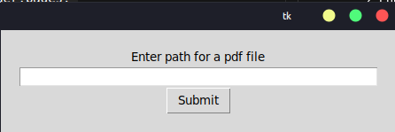

## **PDF to Audiobook Converter**
This Python code allows the user to convert a PDF file to an audiobook (MP3 format) using the gTTS (Google Text-to-Speech) and PyPDF2 libraries. The user needs to provide the path to the PDF file, and the program will convert it into speech  
  
## **Usage**
1. Run the script.
2. Enter the path to the PDF file when prompted.
3. Click the "Submit" button to start the conversion process.
5. Wait for the program to finish converting the PDF to an audiobook (MP3) file.

> Note: The converted file will be saved as "AudioBook.mp3" in the same directory as the Python script. The program may take some time to convert the PDF file, depending on its size and complexity. Please be patient and wait for the program to finish.